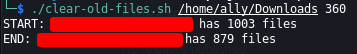

# Automations
Scripts that I create to automate tasks I come across when I would rather spend an hour coding than an 40 minutes doing it.

## Description of `remove_md5_from_filename.py`
This Python script removes the MD5 hash added by Notion to each file when you go to export you notes. The typical file name format would be "[YOUR FOLDER/FILE] [MD5 HASH].[EXT]". An example of this is from my OSCP Notes repo when MSSQL.md had the name "MSSQL 3ccca60abe454be8bee82e97c920a60a.md" after being exported.

For this script to run, just replace the parameter of the function to be the base folder. From there, the MD5 hash will be removed recursivley from all the files and folders while retaining file extensions.

Note: this might not work if you have a .git folder in the the folder. You can either modifiy the code to work or move the folder to a temporary location, run the script, and replace it. The first option is reccommended.
```python remove_md5_from_filename.py```

## Description of `remove-old-files.sh`
This Bash script deletes files that haven't been accessed in a certain number of days. It is assumed that the OS running this script is Debian-based, but if it isn't, then it can be easily modified to work for your OS.
```
./clear-old-files.sh <YOUR_DIRECTORY> <DAYS_SINCE_ACCESSED>

# this example will delete the files in "/home/ally/awesome-dir" that haven't been
# accessed in 60 days or more
./clear-old-files.sh /home/ally/awesome-dir 60 
```
### Example output

